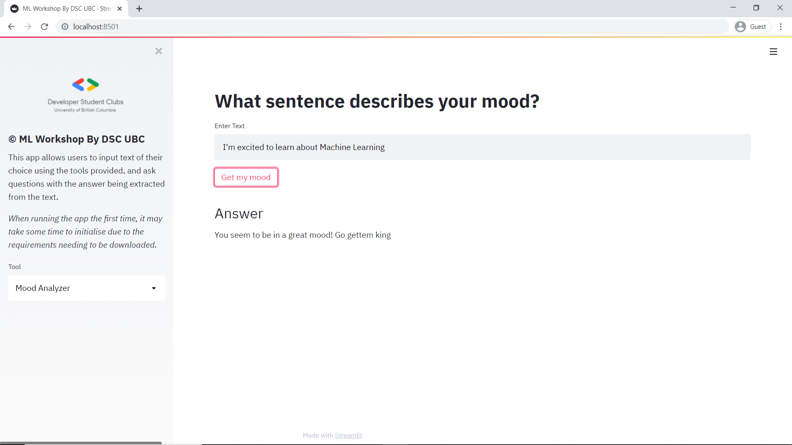
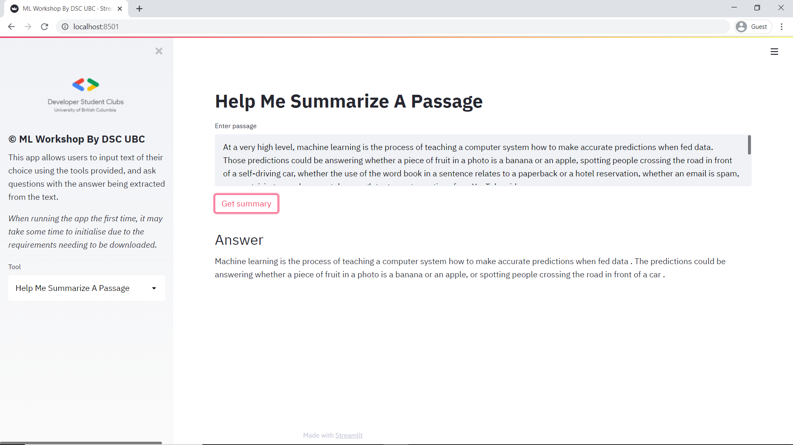
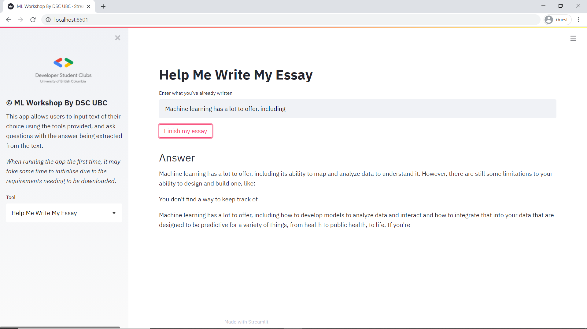
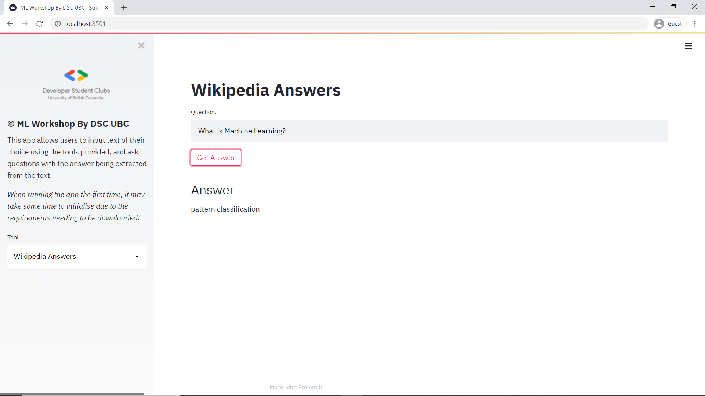

# Intro To Machine Learning

In this workshop, we will be explaining the basics of Machine Learning and NLP and we will also be experimenting with 'straight out-of-the-box' functionalities of HuggingFace Transformers, without using any data, training, pre-training, or fine-tuning of any sorts. Finally, We will be explaining how ML Models can be deployed to a simple Web App using Streamlit. 

Prerequisites: Basics of Python and Understanding of Juypter notebooks

Techstack: Transformers, Streamlit, Beautiful Soup, Requests, PyTorch and Tensorflow

Keywords: NLP, sentiment-analysis, Question-answering, GPT-2, HuggingFace

Time: Feb 18, 2021 05:00 PM Pacific Time (US and Canada)

To watch the Workshop Click here: [Youtube](https://youtu.be/VruTOetuP04)


### To understand how the pretrained models are used click down here:

[](https://colab.research.google.com/github/ubcdsc/ML-Workshop/blob/master/WorkshopNotebook.ipynb)
 
### To run the Dashboard

```
pip install -r requirements.txt 

streamlit run app.py
```

### Dashboard Preview










References:

https://github.com/huggingface/transformers

https://github.com/streamlit/streamlit

https://github.com/bzantium/nlp-guide

https://i.am.ai/roadmap/

https://codelabs.developers.google.com/?cat=TensorFlow

https://www.qwiklabs.com/catalog?keywords=machine+learning
